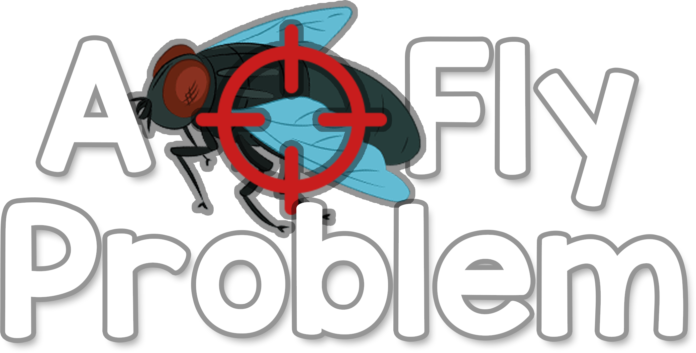

  

---
The game was developed as part of a semester long project for COMP376 at Concordia University.

## **ABOUT**
‘A Fly Problem’ is a first person shooter action game where the goal is to exterminate a colony of flies from your home and office. 

Equip yourself with a variety of weapons and tools and tactically exterminate those pests before it’s too late. Earn and save money by completing exterminations without causing too much destruction!

If you save enough money, you’ll have access to some more… experimental equipment.
## **DEVELOPERS**
- Steven Labelle
- Jimmy Wong
- Xavier Knoll
- Kevin Brousseau
- Lorenzo Monge
- Jahrel Stewart

## **MUSIC**
- Main Menu: Mark Hutson - Ancient Trials
- Level : Kevin Macleod - Prelude and Action
